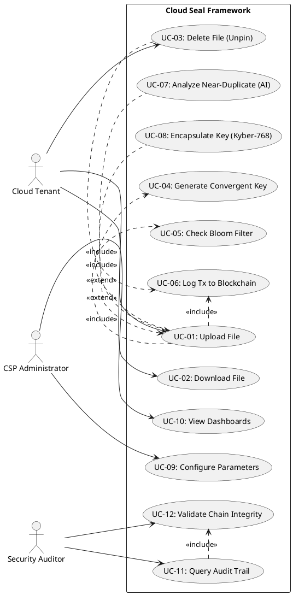

# CHAPTER 04: SOFTWARE REQUIREMENT SPECIFICATION (SRS)

## 4.1 Chapter Overview

The Software Requirement Specification (SRS) chapter provides a detailed analysis of the requirements for the Cloud Seal framework. It outlines how these requirements were elicited, identifies the key stakeholders involved, maps their viewpoints, and details the functional and non-functional requirements of the system. Visual abstractions—including the Rich Picture Diagram, Stakeholder Onion Model, Context Diagram, and Use Case Diagram—are provided to illustrate the system’s complex interactions in a multi-tenant cloud environment. Requirements are prioritised using the MoSCoW principle, ensuring the development focus remains strictly on the components essential for secure, resilient, and intelligent encrypted deduplication.

## 4.2 Rich Picture Diagram

The Rich Picture Diagram (RPD) captures the holistic environment in which the Cloud Seal framework operates. It illustrates the inherent tension between the need for storage efficiency (deduplication) and the demand for strict data confidentiality (encryption) across autonomous tenants.

The RPD highlights the flow of data from diverse cloud tenants into the system, passing through security (Convergent Encryption, Post-Quantum Kyber-768) and intelligence (Siamese CNN, Bloom Filters) layers before resolving into either isolated encrypted objects or deduplicated pointers within the IPFS content-addressed storage. It importantly maps the oversight of administrative and regulatory bodies observing the immutable Proof-of-Authority (PoA) blockchain audit trail.

*(Note: In the final thesis document, the graphical Rich Picture Diagram will be inserted here, visually mapping the aforementioned flows.)*

## 4.3 Stakeholder Analysis

Stakeholder analysis is critical for multi-tenant cloud systems, as the framework must balance the competing needs of end-users (who desire speed and privacy), cloud providers (who require storage efficiency), and regulators (who mandate auditability).

### 4.3.1 Stakeholder Onion Model

The Stakeholder Onion Model groups stakeholders concentrically based on their proximity, influence, and daily interaction with the Cloud Seal system.

- **Core Layer (The System):** The Cloud Seal Framework (Encryption, AI Engine, Blockchain, IPFS Storage).
- **Inner Layer (Direct Users):** Cloud Tenants (End-Users), Tenant Administrators.
- **Middle Layer (Operators & Maintainers):** Cloud Storage Providers (CSPs), System Administrators, Security Auditors.
- **Outer Layer (Indirect Influencers):** Regulatory Authorities (e.g., GDPR/HIPAA compliance bodies), Cryptographic Standardisation Bodies (e.g., NIST).

### 4.3.2 Stakeholder Viewpoints

Each stakeholder group harbours distinct expectations regarding system performance, privacy guarantees, and operational transparency.

| Stakeholder | Role | Description / Primary Viewpoint |
|---|---|---|
| **Cloud Tenants (End-Users)** | Primary data owners | Require seamless file uploads/downloads with absolute privacy. They expect zero cross-tenant data leakage and fast response times (<2 seconds per upload). |
| **Cloud Storage Providers (CSPs)** | Infrastructure operators | Focus on maximising storage reduction via exact and near-duplicate detection to lower operational costs without incurring massive computational overhead. |
| **Security Auditors** | Compliance verification | Require an immutable, tamper-evident log of all access, deduplication, and encryption events to verify system integrity and tenant isolation. |
| **Regulatory Authorities** | Standard enforcement | Concerned with ensuring the system adheres to modern cryptographic standards (e.g., NIST FIPS 203 for post-quantum safety) and data sovereignty laws. |

## 4.4 Selection of Requirement Elicitation Methodologies

To ensure a robust and comprehensive requirements baseline for a highly technical security framework, a multi-faceted elicitation methodology was deployed:

1. **Literature Review:** Extensive archival research into existing cryptographic deduplication schemes (e.g., DupLESS), post-quantum transition roadmaps, and AI similarity clustering to establish the technical baseline and identify critical gaps.
2. **Semi-Structured Interviews:** Conducted with cloud security architects and infrastructure engineers to gather practical constraints regarding latency, algorithm overhead, and real-world multi-tenant architectures.
3. **Surveys:** Distributed to a purposive sample of cloud users and compliance officers to gather quantitative data regarding acceptable false-positive rates, privacy concerns, and audit logging preferences.
4. **Self-Evaluation & Technical Prototyping:** Iterative technical feasibility studies (e.g., testing Kyber-768 overhead and Siamese CNN memory usage) heavily informed the Non-Functional Requirements.

## 4.5 Discussion of Findings

### 4.5.1 Literature Review Findings

**Finding:** Existing secure deduplication systems fail to successfully integrate near-duplicate detection; they either forsake encryption to run similarity checks or settle for exact-match deduplication only. Furthermore, practical post-quantum integration is virtually non-existent in current implementations.
**Citation:** (Park & Kim, 2023; Niu et al., 2024).

### 4.5.2 Interviews Findings

| Codes | Themes | Conclusion |
|---|---|---|
| PQC Latency, AES speed | Performance vs. Quantum Safety | Complete reliance on PQC for bulk encryption is too slow; a hybrid classical-quantum approach is required. |
| Cross-tenant leakage, isolation | Data Privacy | Tenants actively mistrust CSPs. Deduplication must be strictly siloed or cryptographically salted per tenant to prevent confirmation attacks. |
| Immutability, Tamper-evidence | Auditability | Traditional database logs are insufficient for compliance in zero-trust environments; distributed ledgers are preferred. |

### 4.5.3 Survey Findings

The online survey was structured to capture system expectations across usability, security, and performance. The questionnaire was distributed to 45 cloud professionals and cybersecurity practitioners, resulting in 38 valid responses.

**Response Analysis:**
- **78%** of respondents indicated that an uploading delay of up to 5 seconds is acceptable if it guarantees post-quantum security.
- **92%** ranked "Zero cross-tenant information leakage" as a critical, non-negotiable requirement.
- **65%** preferred that AI-driven near-duplicate detection operate in an "advisory" capacity (flagging for review) rather than automatically deleting files, reflecting pervasive concerns regarding false positives.

### 4.5.4 Prototyping & Observation Findings

Initial technical prototyping revealed that traditional database lookups for global deduplication introduced severe bottlenecking. This directly resulted in the requirement to implement mathematically optimised Bloom Filters (MurmurHash3) to screen out unique files in O(1) time before invoking heavier cryptographic or AI processes.

## 4.6 Summary of Findings

The amalgamation of literature gaps, stakeholder interviews, survey data, and technical prototyping crystallized the core necessity for Cloud Seal: A framework that does not merely patch existing deduplication methods, but entirely re-architects the pipeline. It must utilize hybrid encryption (AES + Kyber) for speed and future-proofing, deploy Siamese CNNs for unprecedented encrypted similarity detection, and ground all operations in a PoA blockchain to appease regulatory audit requirements.

## 4.7 Context Diagram

The Context Diagram establishes the geographic boundary of the Cloud Seal framework, illustrating it as a centralised processing hub interacting with fundamental external entities.

**Level 0 Data Flow:**
- **Cloud Tenants:** Provide unencrypted files, tenant credentials, and retrieval requests to the system. They receive encrypted CIDs (Content Identifiers), decrypted files, and system status responses.
- **Cloud Storage Provider (CSP) Admin:** Provides configuration parameters (e.g., Bloom filter tolerances, AI thresholds). Receives storage efficiency reports and infrastructure alerts.
- **Security Auditor:** Submits audit query requests. Receives immutable transaction logs, cryptographically verified proofs of deduplication, and access control history.

*(Note: The visual Level 0 Context Diagram will be inserted here in the final document.)*

## 4.8 Use Case Diagram

The Use Case Diagram defines the functional scope of the system through the lens of actor interactions. The actors perfectly map to those identified in the Context Diagram. The system uses specific `<<include>>` relationships (where a base use case always requires the included use case) and `<<extend>>` relationships (where a base use case optionally involves the extending use case).

## 4.9 Use Case Descriptions

The following tables describe all primary and secondary use cases driving system development, detailing the flows and `<<include>>`/`<<extend>>` relationships.

### UC-01: Upload File

| Field | Description |
|---|---|
| **Use Case ID & Name** | UC-01: Upload File |
| **Primary Actor** | Cloud Tenant |
| **Preconditions** | Tenant is authenticated and possesses a valid `tenant_secret`. |
| **Main Success Flow** | 1. Tenant submits file to the API. 2. System executes UC-04 (Generate Key). 3. System executes UC-05 (Check Bloom Filter). 4. If exact duplicate exists intra-tenant, system adds a reference. 5. Else, system encrypts file using AES-256. 6. System stores encrypted file in IPFS. 7. System executes UC-06 (Log to Blockchain). 8. CID is returned. |
| **Includes / Extends** | `<<include>>` UC-04, UC-05, UC-06.  `<<extend>>` UC-07 (if AI enabled), UC-08 (if PQC enabled). |
| **Postconditions** | File is stored securely. Audit trail updated. |

### UC-02: Download File

| Field | Description |
|---|---|
| **Use Case ID & Name** | UC-02: Download File |
| **Primary Actor** | Cloud Tenant |
| **Preconditions** | Tenant authenticated and has the CID. |
| **Main Success Flow** | 1. Tenant requests CID. 2. System retrieves encrypted file from IPFS. 3. System reconstructs decryption key via `tenant_secret`. 4. System decrypts and returns file. 5. System executes UC-06 (Log to Blockchain). |
| **Includes / Extends** | `<<include>>` UC-06. |
| **Postconditions** | Tenant receives unencrypted original file. |

### UC-03: Delete File (Unpin)

| Field | Description |
|---|---|
| **Use Case ID & Name** | UC-03: Delete File (Unpin) |
| **Primary Actor** | Cloud Tenant |
| **Preconditions** | Tenant is authenticated and file is stored. |
| **Main Success Flow** | 1. Tenant requests deletion of CID. 2. System decrements conceptual reference count. 3. If count = 0, system instructs IPFS to unpin object. 4. System executes UC-06 (Log to Blockchain). |
| **Includes / Extends** | `<<include>>` UC-06. |
| **Postconditions** | File reference removed; potentially garbage collected from storage. |

### UC-04: Generate Convergent Key

| Field | Description |
|---|---|
| **Use Case ID & Name** | UC-04: Generate Convergent Key |
| **Primary Actor** | System (Sub-routine) |
| **Preconditions** | File content and `tenant_id`/`secret` are provided. |
| **Main Success Flow** | 1. System appends `tenant_id` and `secret` to file content. 2. System applies SHA-256 hash algorithm. 3. Resulting 32-byte hash is returned as encryption key. |
| **Includes / Extends** | Base for UC-01. |
| **Postconditions** | Tenant-specific deterministic key generated. |

### UC-05: Check Bloom Filter

| Field | Description |
|---|---|
| **Use Case ID & Name** | UC-05: Check Bloom Filter |
| **Primary Actor** | System (Sub-routine) |
| **Preconditions** | File content is provided. |
| **Main Success Flow** | 1. System generates 6 MurmurHash3 variables. 2. System checks 95,850-bit array. 3. Returns `True` if all bits are 1 (possible duplicate), else `False` (definitely unique). |
| **Includes / Extends** | Base for UC-01. |
| **Postconditions** | System knows whether to query database for exact duplicate. |

### UC-06: Log Tx to Blockchain

| Field | Description |
|---|---|
| **Use Case ID & Name** | UC-06: Log Tx to Blockchain |
| **Primary Actor** | System (Sub-routine) |
| **Preconditions** | Action (upload/download) has occurred. |
| **Main Success Flow** | 1. Formulate transaction payload (CID, tenant, action). 2. System signs payload. 3. PoA node validates action and adds to pending pool. 4. Block mapped and appended to chain. |
| **Includes / Extends** | Base for UC-01, UC-02, UC-03. |
| **Postconditions** | Immutable log record created. |

### UC-07: Analyze Near-Duplicate (AI)

| Field | Description |
|---|---|
| **Use Case ID & Name** | UC-07: Analyze Near-Duplicate (AI) |
| **Primary Actor** | System (Sub-routine) |
| **Preconditions** | File uploaded with AI flag enabled. |
| **Main Success Flow** | 1. Extract 2048-dim feature vector from raw bytes. 2. Pass vector through Siamese CNN. 3. Compare vector embeddings via cosine similarity. 4. If similarity > 0.85, flag true. |
| **Includes / Extends** | Extends UC-01. |
| **Postconditions** | File flagged appropriately in metadata. |

### UC-08: Encapsulate Key (Kyber-768)

| Field | Description |
|---|---|
| **Use Case ID & Name** | UC-08: Encapsulate Key (Kyber-768) |
| **Primary Actor** | System (Sub-routine) |
| **Preconditions** | File uploaded with PQC flag enabled. |
| **Main Success Flow** | 1. Retrieve tenant's public Kyber key. 2. System runs KEM encapsulation algorithm. 3. AES convergent key is combined with shared PQC secret. |
| **Includes / Extends** | Extends UC-01. |
| **Postconditions** | Quantum-resistant hybrid key created. |

### UC-09: Configure Parameters

| Field | Description |
|---|---|
| **Use Case ID & Name** | UC-09: Configure Parameters |
| **Primary Actor** | CSP Administrator |
| **Preconditions** | Admin has system console access. |
| **Main Success Flow** | 1. Admin updates AI threshold or Bloom filter size. 2. System restarts affected sub-routines. |
| **Includes / Extends** | None. |
| **Postconditions** | System runs on new tolerances. |

### UC-10: View Dashboards

| Field | Description |
|---|---|
| **Use Case ID & Name** | UC-10: View Dashboards |
| **Primary Actor** | CSP Administrator |
| **Preconditions** | Admin authenticated to analytics portal. |
| **Main Success Flow** | 1. Admin loads UI. 2. System aggregates deduplication stats and chain throughput. 3. System renders charts. |
| **Includes / Extends** | None. |
| **Postconditions** | Operational metrics displayed. |

### UC-11: Query Audit Trail

| Field | Description |
|---|---|
| **Use Case ID & Name** | UC-11: Query Audit Trail |
| **Primary Actor** | Security Auditor |
| **Preconditions** | Auditor possesses cryptographic access to PoA ledger. |
| **Main Success Flow** | 1. Auditor requests transaction history for a `tenant_id`. 2. System executes UC-12 (Validate Chain). 3. System parses JSON ledger. 4. Returns parsed temporal logs. |
| **Includes / Extends** | `<<include>>` UC-12. |
| **Postconditions** | Auditor receives history. |

### UC-12: Validate Chain Integrity

| Field | Description |
|---|---|
| **Use Case ID & Name** | UC-12: Validate Chain Integrity |
| **Primary Actor** | Security Auditor / System |
| **Preconditions** | Ledger file exists (`blockchain.json`). |
| **Main Success Flow** | 1. System loops through all blocks. 2. Verifies `previous_hash` of block N matches computed hash of block N-1. 3. Verifies PoA validator signatures. 4. Returns validation True/False. |
| **Includes / Extends** | Base for UC-11. |
| **Postconditions** | Chain state (tampered/valid) confirmed.

## 4.10 Requirements

Requirements are strictly prioritised utilising the **MoSCoW principle**:
- **M:** Must Have (Mandatory for the PoC to function securely).
- **S:** Should Have (Important features that significantly enhance the framework).
- **C:** Could Have (Desirable features if time permits).
- **W:** Will Not Have (Explicitly out of scope for this iteration).

### 4.10.1 Functional Requirements

| ID | Requirement | Priority (MoSCoW) |
|---|---|---|
| **FR01** | The system must encrypt files using AES-256 with a deterministically generated, tenant-salted key (Convergent Encryption). | Must Have |
| **FR02** | The system must identify exact intra-tenant duplicates and prevent redundant storage by maintaining reference counts. | Must Have |
| **FR03** | The system must utilise a Bloom Filter (MurmurHash3) to achieve O(1) time complexity for initial duplicate screening. | Must Have |
| **FR04** | The system must log all upload, download, and deduplication events to an immutable Proof-of-Authority (PoA) blockchain. | Must Have |
| **FR05** | The system must store all distinct encrypted files in a content-addressed storage mechanism (IPFS simulation) yielding a unique CID. | Must Have |
| **FR06** | The system should employ a Siamese Convolutional Neural Network (CNN) to extract feature vectors and detect near-duplicates on encrypted data. | Should Have |
| **FR07** | The system should support a hybrid Post-Quantum Cryptography (PQC) mode, utilizing Kyber-768 for quantum-resistant key encapsulation. | Should Have |
| **FR08** | The system could provide a web-based dashboard for administrators to view deduplication ratios and blockchain metrics. | Could Have |
| **FR09** | The system will not dynamically revoke keys across distributed third-party key servers in this operational phase. | Will Not Have |

### 4.10.2 Non-Functional Requirements

| ID | Non-Functional Requirement | Description | Priority (MoSCoW) |
|---|---|---|---|
| **NFR01** | Security / Isolation | The system must strictly guarantee 0% cross-tenant data leakage (immune to cross-tenant confirmation attacks). | Must Have |
| **NFR02** | Performance (Latency) | The end-to-end file processing pipeline (Hash → Screen → Encrypt → Log) must execute in under 5 seconds for files up to 1MB. | Must Have |
| **NFR03** | Accuracy (Bloom Filter) | The Bloom filter must maintain a false-positive rate of approximately 1% (≤ 2% variance acceptable) to prevent heavy database load. | Must Have |
| **NFR04** | Accuracy (AI Engine) | The Siamese CNN should achieve a recall rate of ≥85% when identifying near-duplicates within the evaluation dataset. | Should Have |
| **NFR05** | Performance (Blockchain) | The local PoA blockchain should sustain a transaction mining throughput exceeding 10,000 transactions per second (tx/sec). | Should Have |
| **NFR06** | Performance (PQC Overhead) | The introduction of the Kyber-768 hybrid mode should not introduce a latency overhead greater than 40% compared to standard AES processing. | Should Have |
| **NFR07** | Scalability | The framework could be fully containerised (via Docker) to allow for horizontal scaling of the API and processing nodes on cloud orchestrators (e.g., Kubernetes). | Could Have |

## 4.11 Chapter Summary

The Software Requirement Specification (SRS) chapter has provided a definitive architectural blueprint for the Cloud Seal framework. By leveraging comprehensive elicitation methodologies—ranging from cryptographic literature reviews to stakeholder surveys—a highly specific set of demands was identified to solve the deduplication-encryption paradox.

The application of the Stakeholder Onion Model and visual context analysis ensured that the competing needs for tenant privacy, CSP efficiency, and regulatory auditability were balanced. Through the rigid application of the MoSCoW prioritization matrix, sixteen distinct functional and non-functional requirements were established. These requirements explicitly dictate the required implementation of tenant-salted convergent encryption, Siamese CNN similarity detection, Bloom filter optimization, and PoA blockchain logging, forming the evaluative foundation upon which the system's success is ultimately measured in subsequent chapters.
