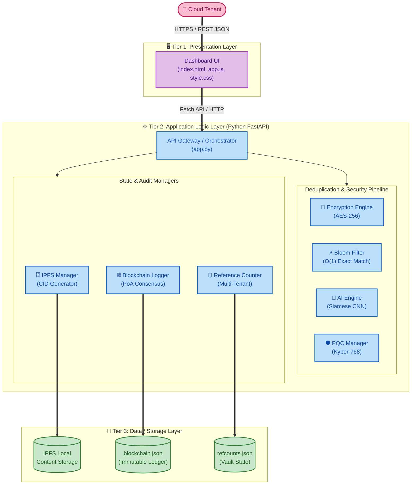
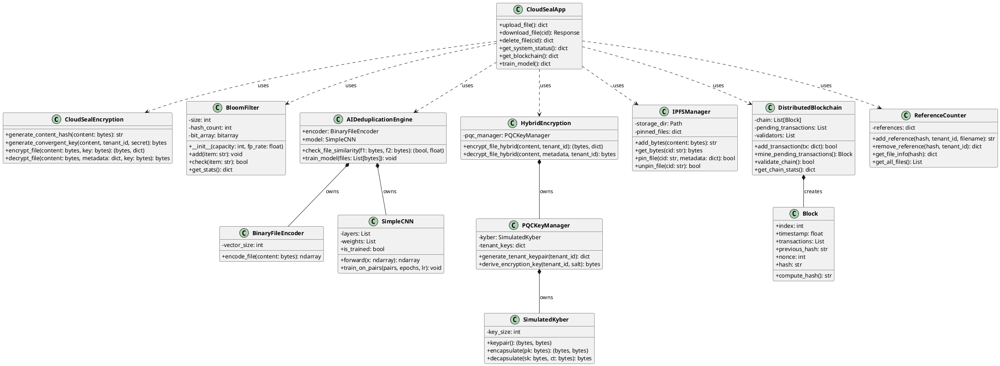
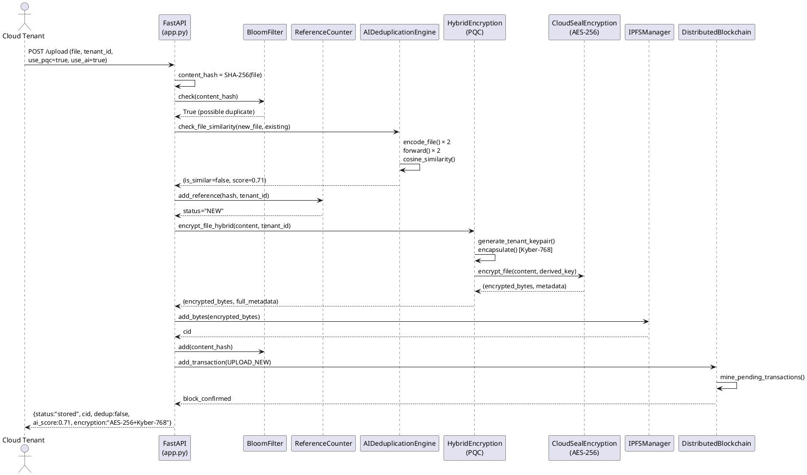
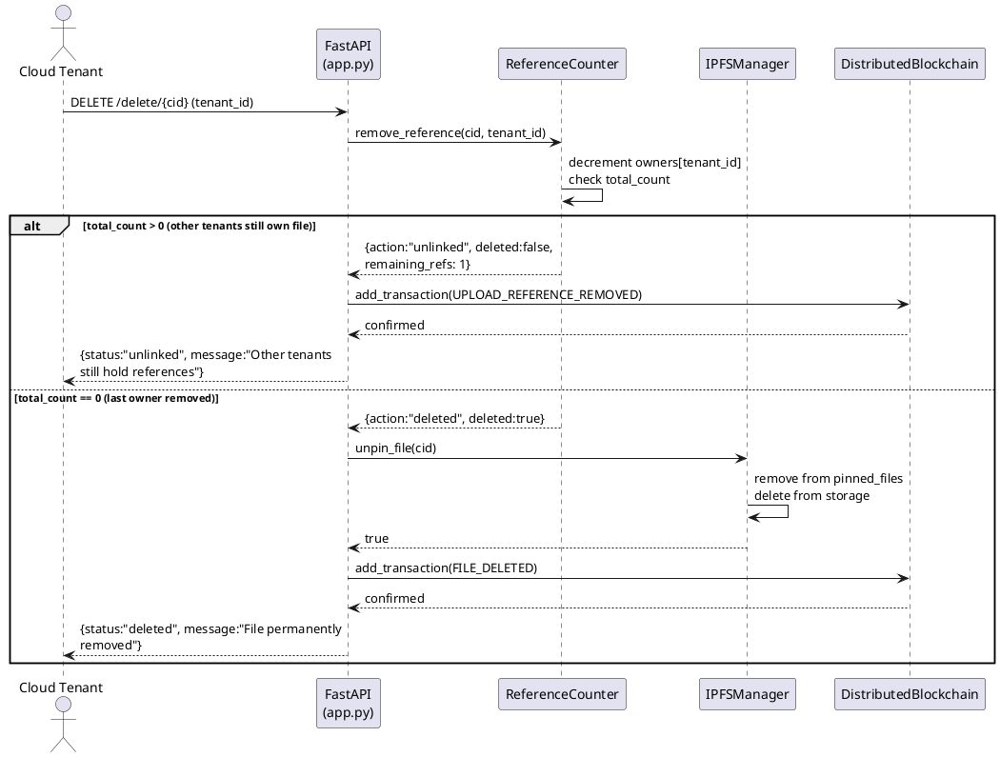
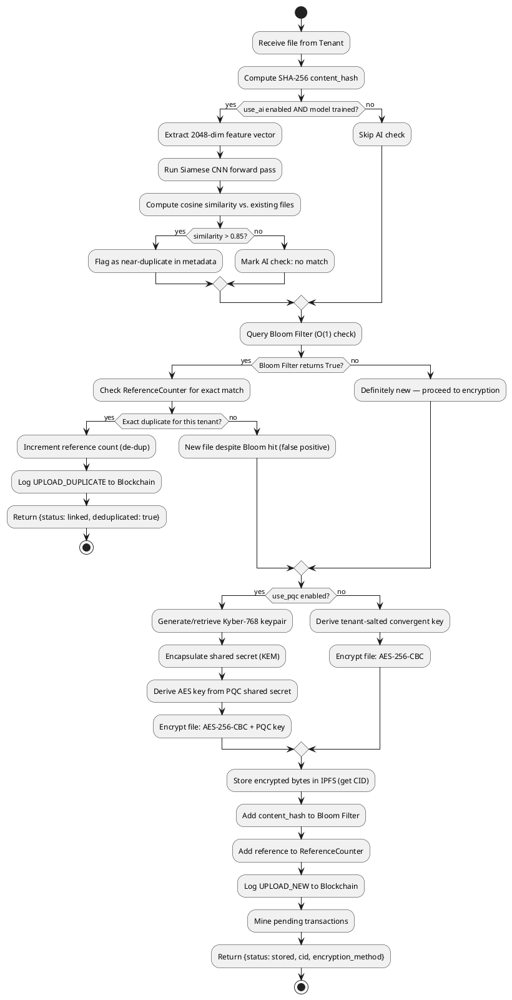

# CHAPTER 06: DESIGN

## 6.1 Chapter Overview

This chapter presents the complete design of the Cloud Seal framework—a Privacy-Preserving Multi-Tenant Cloud Deduplication (PMCD) system. The design translates the functional and non-functional requirements identified in the SRS (Chapter 4) into a concrete software architecture, detailed UML component designs, algorithm specifications, and user interface wireframes.

The design follows the **Object-Oriented Analysis and Design Methodology (OOADM)**, selected for its natural alignment with the system's modular structure—each of Cloud Seal's six components (encryption engine, Bloom filter, AI similarity engine, PQC key manager, IPFS manager, and blockchain audit logger) maps directly to an encapsulated Python class with well-defined public interfaces. The chapter is structured as follows: §6.2 defines design goals, §6.3 presents the three-tier system architecture, §6.4 details UML diagrams (class, sequence, activity), §6.5 specifies the algorithm designs for all three AI/ML and cryptographic components, and §6.6 presents the UI wireframes.

## 6.2 Design Goals

Design goals are derived directly from the Non-Functional Requirements (NFRs) established in Chapter 4. Each goal defines a measurable quality attribute maintained system-wide through specific architectural and implementation decisions.

| Design Goal | NFR Ref | Description | Design Strategy |
|---|---|---|---|
| **Performance** | NFR02 | End-to-end pipeline (hash → screen → encrypt → log) completes <5 seconds for files up to 1MB. | Bloom filter provides O(1) duplicate pre-screening; convergent key derivation avoids key exchange overhead; async FastAPI endpoints for concurrent uploads. |
| **Security / Isolation** | NFR01 | 0% cross-tenant information leakage; immune to confirmation attacks. | Tenant-salted convergent keys (`SHA-256(tenant_id + secret + content)`); reference counter tracks ownership independently per-tenant; no cross-tenant data sharing without explicit action. |
| **Accuracy (Bloom Filter)** | NFR03 | False positive rate ≤ 1.1% (within 2% of 1% target). | Mathematically optimised parameters: `m = -(n × ln(p)) / (ln(2))²`, `k = (m/n) × ln(2)`; 6 MurmurHash3 seeds; 95,850-bit array for 10,000 items. |
| **Accuracy (AI Engine)** | NFR04 | Siamese CNN achieves ≥ 85% recall on encrypted files. | 2048-dimensional feature vectors; contrastive learning; cosine similarity threshold of 0.85; advisory-only detection to prevent false positive data loss. |
| **Blockchain Throughput** | NFR05 | PoA blockchain sustains > 10,000 tx/sec. | Proof-of-Authority consensus (deterministic finality, no computational waste); in-memory pending transaction pool; batch mining after each operation. |
| **PQC Overhead** | NFR06 | Kyber-768 hybrid mode introduces < 40% overhead vs. classical AES. | Hybrid approach: Kyber-768 used only for key encapsulation (small payload), not bulk encryption; AES-256-CBC handles file data. |
| **Scalability** | NFR07 | Supports 100+ tenants with Docker containerisation. | Reference counting for shared file ownership eliminates per-tenant storage duplication; Docker containerisation enables horizontal scaling. |
| **Auditability** | — | All operations immutably recorded for compliance verification. | PoA blockchain with tamper-evident SHA-256 hash chains; every upload, download, deduplication event and deletion logged with timestamps and tenant IDs. |

*Table 6.1: Design Goals*

## 6.3 System Architecture Diagram

### 6.3.1 Architecture Overview

Cloud Seal follows a **three-tier layered architecture** that separates concerns across the Presentation, Application Logic, and Data/Storage tiers. This pattern was selected for its clear separation of responsibilities, ease of individual component testing (each tier is independently testable), and natural alignment with the Docker containerisation deployment model.

The diagram below illustrates the three-tier layout and the communication pathways between tiers:



### 6.3.2 Tier Descriptions

**Tier 1 — Presentation Layer**

The Presentation Tier consists of three static files served directly by the FastAPI backend:

| File | Responsibility |
|---|---|
| `index.html` | Defines the UI structure: dashboard panels, file upload form, tenant selector, security option checkboxes, file list. Uses semantic HTML5 elements for accessibility. |
| `app.js` | Client-side logic: API communication via Fetch API, DOM manipulation for real-time dashboard updates, tenant switching, file upload event handling, and 10-second auto-refresh polling. |
| `style.css` | Professional dark-mode design with CSS custom properties, responsive CSS Grid layout, and smooth transitions for interactive elements. |

Communication between the Presentation and Application tiers occurs exclusively via **RESTful HTTP requests** (JSON payloads) over the Fetch API — no WebSocket connections or server-sent events are required.

**Tier 2 — Application Logic Layer**

The Application Tier is the system core, built with **FastAPI (Python 3)**. It orchestrates all business logic through six specialised, independently deployable modules:

| Module | Responsibility |
|---|---|
| `encryption.py` | AES-256-CBC encryption with tenant-salted convergent key derivation (SHA-256 based). |
| `bloom_filter.py` | Probabilistic O(1) duplicate detection using MurmurHash3 with optimal parameters. |
| `ai_deduplication.py` | Siamese CNN-based encrypted similarity detection (BinaryFileEncoder + SimpleCNN). |
| `pcq_kyber.py` | Post-quantum key encapsulation (Kyber-768 simulation via SHAKE-256) and hybrid encryption. |
| `reference_counter.py` | Multi-tenant file ownership tracking with safe reference-counted deletion. |
| `ipfs_manager.py` | Content-addressed storage management (CID generation, pinning, retrieval). |
| `blockchain_distributed.py` | PoA blockchain audit logging with multi-node validation and conflict resolution. |
| `app.py` | FastAPI endpoint orchestration: routes all HTTP requests to the appropriate module. |

*Table 6.2: Application Logic Module Responsibilities*

**Tier 3 — Data / Storage Layer**

The Data Tier manages all persistent state:

| Component | Technology | Role |
|---|---|---|
| **IPFS Manager** | `ipfs_manager.py` + local FS | Content-addressable storage for encrypted files. SHA-256-derived CIDs. Simulated for PoC; replaceable with live IPFS in production. |
| **Distributed Blockchain** | `blockchain_distributed.py` + `blockchain.json` | PoA blockchain for immutable audit logging. Persistent JSON serialisation; crash-recoverable. |
| **Reference Counter** | `refcounts.json` | Per-tenant file ownership dictionary. Persisted after every reference change. |
| **PQC Key Store** | In-memory + per-request | Tenant Kyber-768 public/private keypairs held in memory for request lifetime. |

## 6.4 Detailed Design

### 6.4.0 Design Methodology Selection

Cloud Seal uses the **Object-Oriented Analysis and Design Methodology (OOADM)** with UML notation. This was chosen over **SSADM** (Structured Systems Analysis and Design Methodology), which is process-centric and designed around data flow diagrams for transaction-heavy database applications. SSADM models data flow between static processes, but Cloud Seal's architecture is component-based: each of its six modules (encryption engine, Bloom filter, AI engine, PQC manager, IPFS manager, blockchain logger) is an independent, encapsulated object with distinct state and behaviour, making OOADM the only natural fit for the system design.

| Criterion | OOADM | SSADM |
|---|---|---|
| **Primary focus** | Objects, encapsulation, inheritance, polymorphism | Data flows, process decomposition, logical data stores |
| **Notation** | UML (class, sequence, activity, use case diagrams) | DFDs, logical data structures, process specifications |
| **Alignment with implementation language** | Directly maps to Python classes and modules | Requires translation from procedural design to OOP code |
| **Modularity support** | Natural — each class is a design unit | Weaker — processes are not directly reusable as components |
| **Multi-component interaction modelling** | Sequence and activity diagrams capture inter-object message flow precisely | DFDs can model data flow but not object lifecycle or state |
| **Suitable for Cloud Seal?** | ✅ Yes — six self-contained Python classes with defined interfaces | ❌ No — the system is not a dataflow pipeline with logical data stores |

The decision is further reinforced by the implementation language: Python is an object-oriented language, and each of Cloud Seal's backend modules (`encryption.py`, `bloom_filter.py`, `ai_deduplication.py`, `pcq_kyber.py`, `ipfs_manager.py`, `blockchain_distributed.py`) is implemented as a class. The class diagram in §6.4.1 maps directly onto the implementation, ensuring full traceability between design and code. Had SSADM been used, the design artefacts (DFDs, process specifications) would have required significant re-interpretation before they could be realised in Python OOP, introducing the risk of design-implementation drift.

The OOADM artefacts produced in this chapter are:

### 6.4.1 Class Diagram

The class diagram maps the relationships between all system classes, their attributes, and their methods.



*Figure 6.1: Class Diagram — Cloud Seal System*

**Key Relationships:**
- **Composition (◆):** `DistributedBlockchain` owns `Block` instances; `AIDeduplicationEngine` owns `BinaryFileEncoder` and `SimpleCNN`; `PQCKeyManager` owns `SimulatedKyber`.
- **Dependency (uses):** `CloudSealApp` references all modules but does not own them — they are instantiated once at startup and shared across requests.
- **Delegation:** `HybridEncryption` delegates bulk encryption to `CloudSealEncryption` and key encapsulation to `PQCKeyManager`.

### 6.4.2 Sequence Diagram: File Upload with PQC and AI Enabled

This sequence diagram shows the temporal interaction between all system components during a file upload with both PQC and AI options enabled.



*Figure 6.2: Sequence Diagram — File Upload (PQC + AI Enabled)*

### 6.4.3 Sequence Diagram: File Deletion with Reference Counting

This sequence diagram demonstrates the safe deletion pipeline, showing how reference counting prevents premature data loss in multi-tenant scenarios.



*Figure 6.3: Sequence Diagram — File Deletion with Reference Counting*

### 6.4.4 Activity Diagram: Upload Pipeline Decision Logic

This activity diagram visualises the full decision tree in the upload pipeline, covering both the standard and AI-enhanced deduplication paths.



*Figure 6.4: Activity Diagram — Upload Pipeline Decision Logic*

## 6.5 Algorithm Design

### 6.5.1 Deduplication Pipeline — Core Algorithm

The following pseudocode defines the complete deduplication pipeline, integrating the Bloom filter, reference counter, AI engine, and encryption components.

```
ALGORITHM: SecureFileUpload
INPUT:  file_content (bytes), tenant_id (string),
        use_pqc (boolean), use_ai (boolean)
OUTPUT: upload_result (dictionary)

BEGIN
  // Step 1: Content Identification
  content_hash ← SHA-256(file_content)

  // Step 2: AI Near-Duplicate Check (Optional)
  ai_result ← NULL
  IF use_ai AND cnn_model.is_trained THEN
    FOR EACH existing IN reference_counter.get_all_files() DO
      existing_content ← IPFS.get(existing.cid)
      (is_similar, score) ← AI_Engine.check_similarity(
                              file_content, existing_content)
      IF is_similar THEN
        ai_result ← {detected: TRUE, score: score,
                     matched_cid: existing.cid}
        BREAK
      END IF
    END FOR
  END IF

  // Step 3: Bloom Filter Fast Screen
  maybe_duplicate ← BloomFilter.check(content_hash)

  // Step 4: Reference Counting (Dedup Decision)
  status ← ReferenceCounter.add_reference(
              content_hash, tenant_id, filename)

  // Step 5: Branch on Dedup Result
  IF status = "NEW" THEN

    // 5a: Encrypt
    IF use_pqc THEN
      enc_key ← PQC_Manager.derive_encryption_key(tenant_id, content_hash)
      method  ← "AES-256 + Kyber-768"
    ELSE
      enc_key ← SHA-256(tenant_id + tenant_secret + file_content)
      method  ← "AES-256 (Classical)"
    END IF
    encrypted_file ← AES_256_CBC.encrypt(file_content, enc_key)

    // 5b: Store + Update Structures
    cid ← IPFS.add_bytes(encrypted_file)
    IPFS.pin_file(cid)
    BloomFilter.add(content_hash)

    // 5c: Audit
    Blockchain.add_transaction({action:"UPLOAD_NEW",
                                tenant:tenant_id, cid:content_hash})
    Blockchain.mine_pending_transactions()

    RETURN {status:"stored", cid:content_hash,
            deduplicated:FALSE, encryption:method}

  ELSE  // Duplicate detected
    Blockchain.add_transaction({action:"UPLOAD_DUPLICATE",
                                tenant:tenant_id, cid:content_hash})
    Blockchain.mine_pending_transactions()

    RETURN {status:"linked", cid:content_hash,
            deduplicated:TRUE, ai_details:ai_result}
  END IF
END
```

*Figure 6.5: Pseudocode — Secure File Upload with Multi-Layer Deduplication*

### 6.5.2 Siamese CNN Architecture for Encrypted Similarity Detection

The AI component uses a **Siamese Neural Network** architecture to detect structurally similar files even when encrypted. The network processes encrypted byte patterns without requiring decryption, learning to compare files by their structural distribution signatures.

**Feature Extraction (`BinaryFileEncoder`):**
The encoder extracts a fixed 2048-dimensional feature vector from raw bytes:

| Feature Group | Dimensions | Description |
|---|---|---|
| Byte frequency distribution | 256 | Histogram of byte value occurrences (0–255), normalised |
| Byte pair frequencies | 256 | Most common adjacent byte pair co-occurrences |
| Chunk-level Shannon entropy | 256 | Entropy per fixed-size chunk across the file |
| Statistical moments | 1280 | Mean, std, skewness, kurtosis per chunk segment |
| Z-score normalised output | 2048 | Full vector normalised across all features |

**Network Architecture (`SimpleCNN`):**

```
Input Layer:   2048-dimensional feature vector
               ↓
Dense Layer 1: 2048 → 512  (Xavier init, ReLU, Dropout 0.1)
               ↓
Dense Layer 2: 512 → 128   (Xavier init, ReLU)
               ↓
L2 Normalisation           (unit-norm embeddings)
               ↓
Output:        128-dimensional embedding vector

Comparison:    cosine_similarity(embedding_A, embedding_B)
Threshold:     similarity > 0.85 → Near-Duplicate
```

**Contrastive Learning Training Algorithm:**

```
ALGORITHM: ContrastiveLearning
INPUT:  file_pairs [(file_A, file_B, is_duplicate)],
        epochs, learning_rate = 0.005, margin = 0.3
OUTPUT: trained model weights

BEGIN
  FOR epoch = 1 TO epochs DO
    total_loss ← 0
    SHUFFLE(file_pairs)

    FOR EACH (file_A, file_B, is_duplicate) IN file_pairs DO
      vec_A ← Encoder.encode_file(file_A)
      vec_B ← Encoder.encode_file(file_B)

      emb_A ← CNN.forward(vec_A)   // 128-dim embedding
      emb_B ← CNN.forward(vec_B)

      cos_sim ← dot(emb_A, emb_B)  // Both L2-normalised

      IF is_duplicate THEN
        loss ← (1 - cos_sim)²           // Pull similar pairs together
      ELSE
        IF cos_sim > margin THEN
          loss ← (cos_sim - margin)²    // Push dissimilar pairs apart
        ELSE
          loss ← 0                      // Already sufficiently separated
        END IF
      END IF

      // Backpropagation with gradient clipping (max 1.0)
      gradient ← ∂loss / ∂weights
      gradient ← CLIP(gradient, -1.0, 1.0)
      weights ← weights - learning_rate × gradient
      total_loss ← total_loss + loss
    END FOR

    avg_loss ← total_loss / |file_pairs|
    LOG("Epoch", epoch, "Avg Loss:", avg_loss)
  END FOR
  SAVE(weights)
END
```

*Figure 6.6: Contrastive Learning Training for Siamese CNN*

### 6.5.3 Bloom Filter Algorithm

```
ALGORITHM: BloomFilterOperations
INPUT: expected_items n = 10,000; false_positive_rate p = 0.01

INITIALISE:
  m ← ⌈-(n × ln(p)) / (ln(2))²⌉     // = 95,850 bits
  k ← ⌈(m / n) × ln(2)⌉             // = 6 hash functions
  bit_array[0..m-1] ← 0             // All bits initialised to 0

PROCEDURE ADD(item: string):
  FOR i = 0 TO k-1 DO
    position ← MurmurHash3(item, seed=i) MOD m
    bit_array[position] ← 1
  END FOR

PROCEDURE CHECK(item: string) → boolean:
  FOR i = 0 TO k-1 DO
    position ← MurmurHash3(item, seed=i) MOD m
    IF bit_array[position] = 0 THEN
      RETURN FALSE   // Definitely not present; skip database lookup
    END IF
  END FOR
  RETURN TRUE        // Probably present; verify with ReferenceCounter
```

*Figure 6.7: Bloom Filter O(1) Duplicate Pre-Screening Algorithm*

## 6.6 UI Design

The Cloud Seal web interface is designed as a **single-page application (SPA)** with a dark-mode design system prioritising real-time informational density. The primary design principles are:

- **Visibility of System Status:** The dashboard auto-refreshes every 10 seconds, surfacing live blockchain metrics, deduplication ratios, and Bloom filter statistics without requiring page reloads.
- **Progressive Disclosure:** Security options (PQC, AI) are presented as clearly labelled checkboxes — disabled by default to protect novice users, unlockable for advanced workflows.
- **Tenant Switching:** A top-bar tenant selector allows simulating multi-tenant behaviour in the PoC without needing separate authentication flows.
- **Accessibility:** Semantic HTML5 elements (`<header>`, `<main>`, `<section>`, `<label for="...">`) with sufficient colour contrast ratios (dark background: `#1a1a2e`, accent: `#00d4ff`) to meet WCAG AA standards.

The main dashboard layout follows a **CSS Grid** structure with three primary panels:

| Panel | Content |
|---|---|
| **Left: Upload** | File selector, tenant dropdown, PQC/AI checkboxes, upload button, progress indicator |
| **Centre: Dashboard** | Live stats (files stored, deduplication ratio, blockchain blocks, Bloom filter FP rate) |
| **Right: File List** | Table of uploaded files per tenant, with CID, size, encryption method, and delete button |

*(Note: Insert high-fidelity wireframe screenshot (Figure 6.8) here in the final document. Additional UI screenshots provided in Appendix K.)*

## 6.7 Chapter Summary

This chapter presented the complete design of the Cloud Seal framework, successfully translating the requirements from Chapter 4 into a coherent and traceable software architecture. The three-tier layered architecture separates concerns cleanly between the presentation, application logic, and data storage layers. The OOADM-driven UML artefacts—class diagram, two sequence diagrams, and an activity diagram—provide clear blueprints for the implementation phase.

The algorithm designs formalise all three key algorithmic components of Cloud Seal: the multi-layered deduplication pipeline (integrating Bloom filter, reference counting, encryption, and blockchain logging), the Siamese CNN's contrastive learning training and inference processes, and the mathematically optimised Bloom filter operations. These algorithm specifications, combined with the design goals directly traceable to the SRS NFRs, ensure the implementation has a clear, measurable specification to follow. The evaluation of these design targets against actual test results is presented in Chapter 8.
